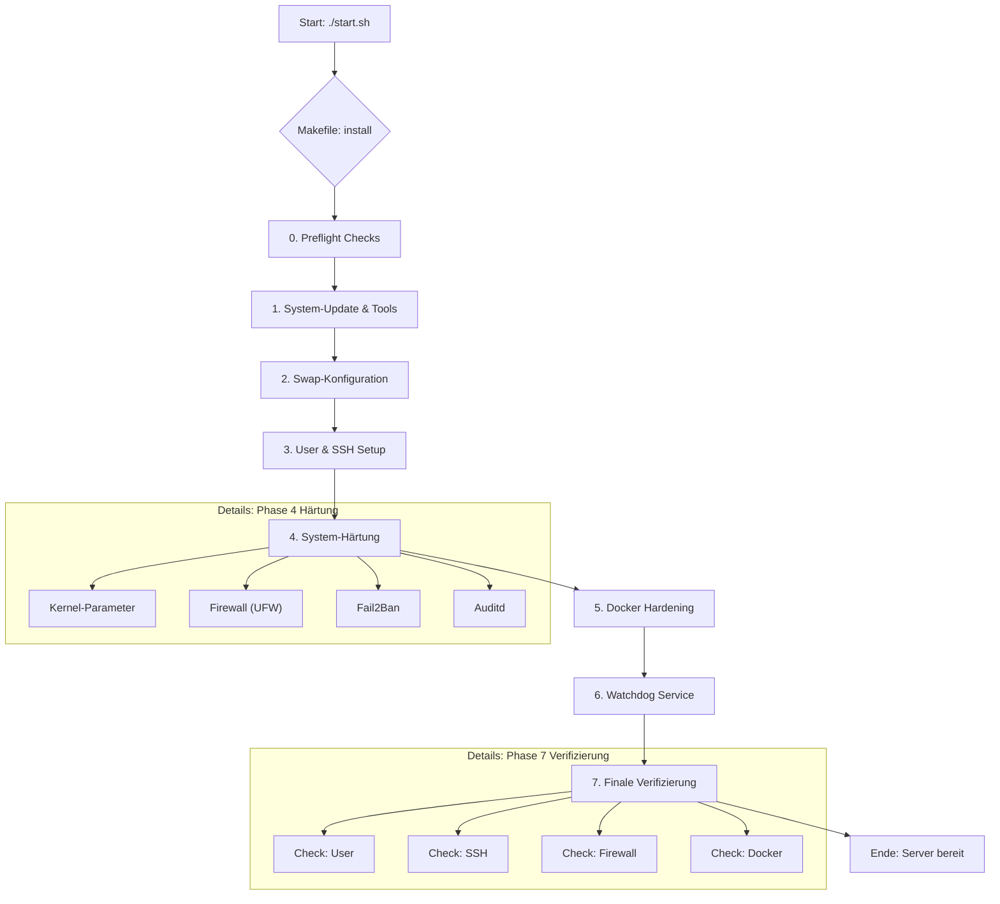

# Infrastruktur & Setup-Flow

Dieses Dokument beschreibt den automatisierten Prozess, mit dem ein Standard-Server in eine sichere Docker-Umgebung verwandelt wird. Der gesamte Prozess wird über ein `Makefile` gesteuert und ist in logische Schritte unterteilt.

## Visualisierung des Setup-Prozesses

Das folgende Diagramm zeigt den Ablauf des Setup-Skripts von Anfang bis Ende.

> Es wird ein Extention benötigt um das Diagram anzuzeigen:
> [https://open-vsx.org/vscode/item?itemName=bierner.markdown-mermaid]. 

## Erklärung der Komponenten

Jeder Schritt im Diagramm hat einen spezifischen Zweck, um die Sicherheit und Stabilität des Servers zu gewährleisten.

| Phase | Komponente | Zweck |
| :--- | :--- | :--- |
| **0. Preflight** | `00-preflight.sh` | Stellt sicher, dass das Skript unter den richtigen Bedingungen (Root-Rechte, Ubuntu 24.04) ausgeführt wird, bevor Änderungen vorgenommen werden. |
| **1. System** | `01-system.sh` | Bringt das Betriebssystem auf den neuesten Stand und installiert alle notwendigen Werkzeuge für die weiteren Schritte (Firewall, Verschlüsselung, etc.). |
| **2. Swap** | `02-swap.sh` | Konfiguriert den Swap-Speicher. Bei wenig RAM wird ein **verschlüsselter** Swap erstellt, um sensible Daten zu schützen. Bei viel RAM wird er aus Sicherheitsgründen deaktiviert. |
| **3. User & SSH** | `03-user-safe.sh` | Erstellt einen neuen, unprivilegierten Benutzer für die tägliche Arbeit und sichert den SSH-Zugang ab. Der "Anti-Lockout"-Mechanismus verhindert, dass man sich versehentlich selbst aussperrt. |
| **4. Härtung** | `Makefile (harden)` | Dies ist das Herzstück der Härtung. Es aktiviert die Firewall, schützt vor Brute-Force-Angriffen, optimiert den Kernel und aktiviert automatische Sicherheitsupdates. |
| **5. Docker** | `04-docker.sh` | Installiert die Docker Engine und wendet eine gehärtete Konfiguration an, um die Angriffsfläche zu minimieren. |
| **6. Watchdog**| `Makefile (watchdog)` | Installiert einen Überwachungsdienst, der regelmäßig prüft, ob versehentlich unsichere Ports geöffnet wurden. |
| **7. Verifizierung**| `99-verify.sh`| Ein abschließender Audit, der prüft, ob alle vorherigen Schritte erfolgreich waren und der Server dem gewünschten Sicherheitsstandard entspricht. |
